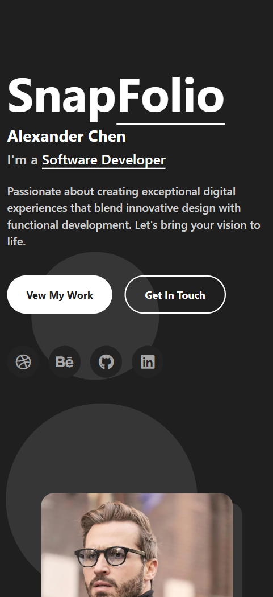
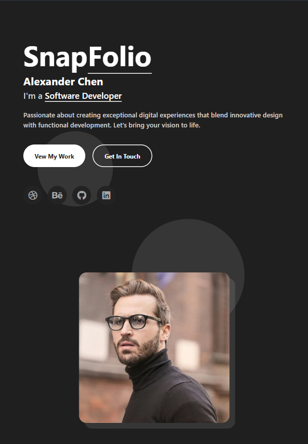
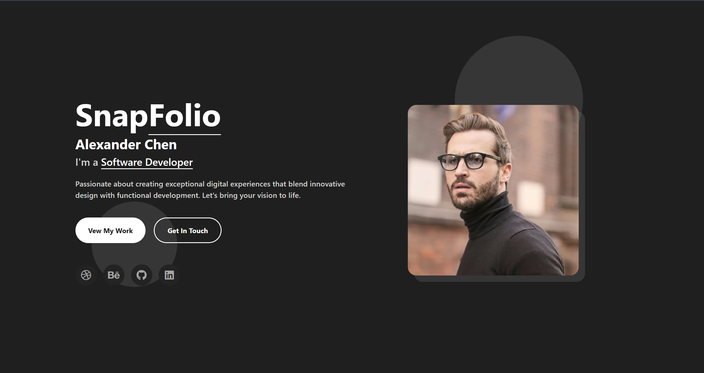

# 🌐 Personal Portfolio Website

📅 Date: April 24, 2026  
👨‍💻 Author: Dipu Ray

---

## 📌 Project Overview

This is a personal portfolio website built using Bootstrap.  
The purpose of this project is to develop my coding skills better.

---

## ✨ Features

- Intro section
- About section
- Profile card design
- Responsive layout

---

## 📂 Project Structure

```
personal-portfolio-website/
│── assets/
    └── images/
│── index.html
│── style.css

```

## 📸 Screenshot

<p align="center">
  <h4>1. Phone Screen:</h4>
  
</p>
<p align="center">
  <h4>2. Tab Screen:</h4>
  
</p>
<p align="center">
  <h4>3. Laptop or Desktop Screen:</h4>
  
</p>

---

⭐ If you like this project, feel free to give it a star!
