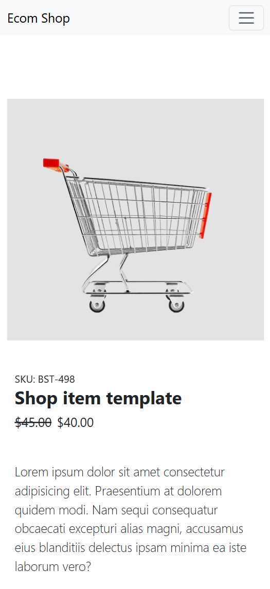
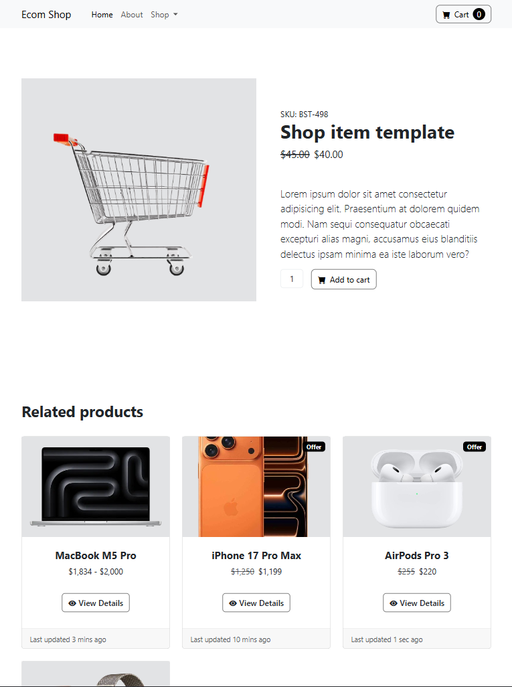
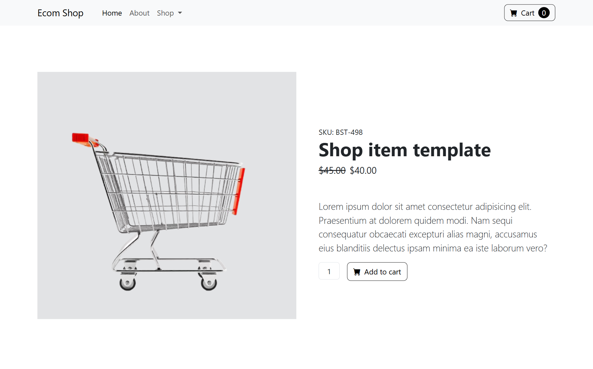

# 🛍️ E-Commerce Website

📅 Date: May 02, 2026  
👨‍💻 Author: Dipu Ray

---

## 📌 Project Overview

This is a **E-Commerce Website** built using **Bootstrap**.  
The purpose of this project is to develop my coding skills better.

---

## ✨ Features

- Product list
- Modern cards
- Readable descriptions
- Responsive layout

---

## 📂 Project Structure

```
e-commerce-website/                 # Project Title
│── assets/                         # Non-Code Files
│    └── images/                    # Images & Graphics
│    └── project-screenshot/        # Project Screenshots
│── README.md                       # Project Documentation
│── index.html                      # HTML + Bootstrap Code
│── style.css                       # CSS Code

```

## 📸 Screenshot

<p align="center">
  <h4>1. Phone Screen:</h4>
  
</p>
<p align="center">
  <h4>2. Tab Screen:</h4>
  
</p>
<p align="center">
  <h4>3. Laptop or Desktop Screen:</h4>
  
</p>

---

⭐ If you like this project, feel free to give it a star!
