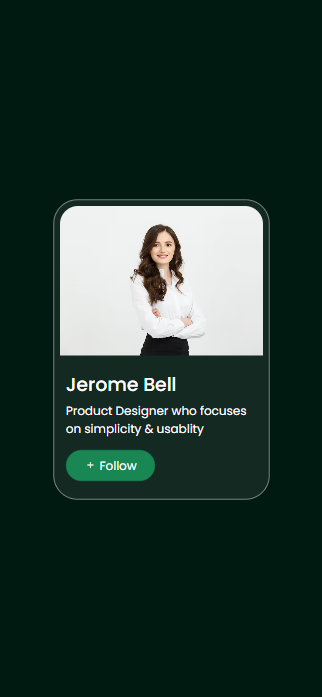
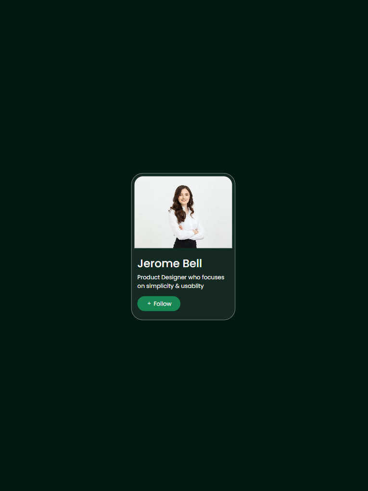
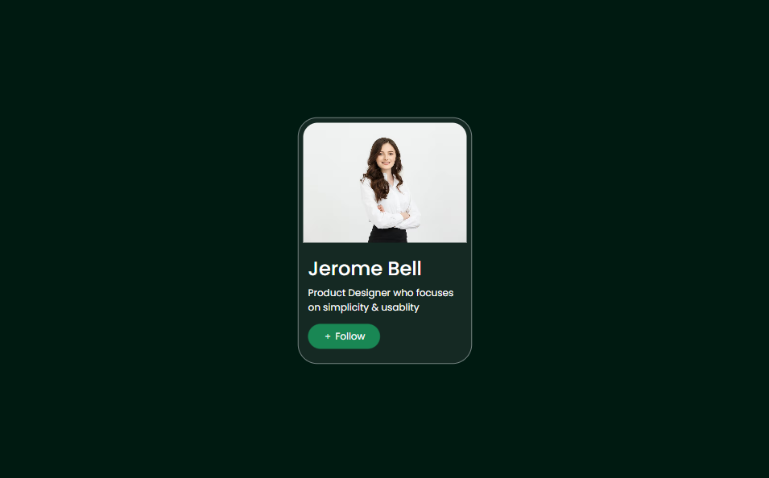

# 📇 Profile Card

📅 Date: May 16, 2026  
👨‍💻 Author: Dipu Ray

---

## 📌 Project Overview

This is a **Profile Card** built using **Bootstrap**.  
The purpose of this project is to develop my coding skills better.

---

## ✨ Features

- Bootstrap Card
- Follow Button
- Responsive layout

---

## 📂 Project Structure

```
profile-card/                       # Project Title
│── assets/                         # Non-Code Files
│    └── images/                    # Cards Images
│    └── project-screenshots/       # Project Screenshots
│── README.md                       # Project Documentation
│── index.html                      # HTML + Bootstrap Code
│── style.css                       # CSS Code

```

## 📸 Screenshot

<p align="center">
  <h4>1. Phone Screen:</h4>
  
</p>
<p align="center">
  <h4>2. Tab Screen:</h4>
  
</p>
<p align="center">
  <h4>3. Laptop or Desktop Screen:</h4>
  
</p>

---

⭐ If you like this project, feel free to give it a star!
